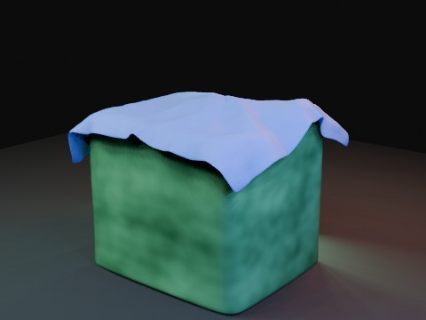

# Cloth Drop on Jelly with Delayed Ball EEVEE

A free cloth sheet falls onto a Soft Body jelly cube, then one rigid-body ball is released exactly two seconds later. The simulation is baked in two stable one-way passes before parallel EEVEE rendering.

- source commit: `69175d40b1c7a38cd2515b7045c457a922a7eedd`
- Actions run: `3` (`36246553134`)
- full artifact: `blender-cloth-drop-jelly-delayed-ball-eevee`

## Blend files

- Git: [cloth-drop-jelly-delayed-ball-eevee.blend](./cloth-drop-jelly-delayed-ball-eevee.blend) (5,981,788 bytes)



## Validation

```json
{
  "video": "cloth-drop-jelly-delayed-ball-eevee.mp4",
  "preview": {
    "path": "output/preview.png",
    "size_bytes": 175471,
    "width": 480,
    "height": 360,
    "luminance_min": 0,
    "luminance_max": 187,
    "luminance_mean": 60.947,
    "luminance_stddev": 50.328,
    "sha256": "2727b3b0b0a85a05df46cd6de4c5e0a922af6c22b14af807f5b02cdefd4d76c2"
  },
  "movie": {
    "path": "output/cloth-drop-jelly-delayed-ball-eevee.mp4",
    "size_bytes": 53856,
    "width": 480,
    "height": 360,
    "duration_seconds": 8.0,
    "avg_frame_rate": "24/1",
    "nb_frames": "192",
    "sha256": "fd6699d394205ac93eb8eedc58455556e5b05220a427736d4ef1354830db119d"
  },
  "report": {
    "engine": "BLENDER_EEVEE",
    "jelly_vertex_count": 866,
    "jelly_max_displacement": 0.847191,
    "jelly_max_displacement_frame": 74,
    "cloth_vertex_count": 1015,
    "cloth_max_displacement": 4.50573,
    "cloth_max_displacement_frame": 192,
    "cloth_min_vertex_z": 0.04645,
    "cloth_min_vertex_z_frame": 192,
    "ball_release_frame": 49,
    "ball_release_seconds": 2.0,
    "ball_final_location": [
      0.28,
      -0.08,
      2.48
    ],
    "possible_proxy_tunneling": false,
    "substeps_per_frame": 8,
    "solver_iterations": 30,
    "blend_size_bytes": 5981788
  }
}
```

## License / ライセンス

Unless otherwise noted, generated assets in this result (including rendered images, video, and generated .blend files) are CC0-1.0. Source code and workflow files used to generate them are MIT-0.

特記のない限り、この成果物内の生成アセット（レンダリング画像、動画、生成された .blend ファイル等）は CC0-1.0、生成に使用したソースコードや workflow は MIT-0 です。

Third-party data, assets, or source material remain subject to their original licenses and terms. These repository licenses apply only to rights we are entitled to grant.

第三者のデータ・アセット・素材・ソースを利用している部分は、利用元のライセンスおよび利用条件に従います。このリポジトリのライセンスは、こちらが許諾できる権利にのみ適用されます。

See ../../LICENSE and ../../LICENSES/ for details.
