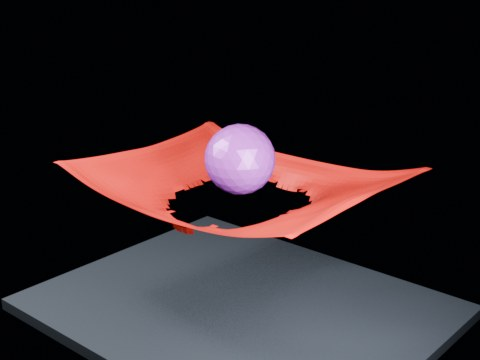

# Ball Drop Tearing — Hammock

A large sphere drops vertically onto a four-corner-pinned horizontal cloth. Tearing is localized near the center to test catch-then-rupture behavior.

- source commit: `2e1914dc1c2f97f3ac0860ff4dd98978939eeb1e`
- Actions run: `4` (`36411738548`)
- Blender line: **5.2 experimental Cloth Dynamics / Tearing**



## Validation

```json
{
  "experiment": "cloth-tearing-ball-drop-hammock-gn52",
  "pattern": "hammock",
  "blender_version": "5.2.2 LTS",
  "impact_frame": 30,
  "tear_observed": true,
  "first_tear_frame": 2,
  "tear_after_planned_contact": false,
  "base_vertices": 1575,
  "max_vertices": 2634,
  "max_components": 333,
  "tear_edge_count": 728,
  "custom_mode_applied": true,
  "preview_frame": 33,
  "preview_sha256": "885e0cb99801ed7e0e4dc6aa3bca9fd7b2c90a250ac57a810c2646d0cc7e1867",
  "video_size_bytes": 79679,
  "blend_size_bytes": 315053
}
```
