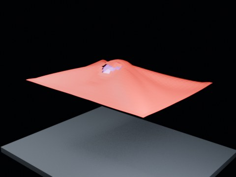

# Ball Drop Tearing — Hammock Threshold 1.60 Fast Ball

Hammock follow-up with threshold 1.60 and a larger, faster prescribed collider. It tests whether impact can overcome a threshold high enough to avoid immediate self tearing.

- source commit: `fdeb60aae5c9d8690f0e91ca944492840a347284`
- Actions run: `6` (`36414569236`)
- Blender line: **5.2 experimental Cloth Dynamics / Tearing**



## Validation

```json
{
  "experiment": "cloth-tearing-ball-drop-hammock-th160-fastball-gn52",
  "pattern": "hammock",
  "blender_version": "5.2.2 LTS",
  "impact_frame": 24,
  "tear_observed": true,
  "first_tear_frame": 3,
  "tear_after_planned_contact": false,
  "base_vertices": 1575,
  "max_vertices": 1607,
  "max_components": 5,
  "tear_edge_count": 728,
  "custom_mode_applied": true,
  "preview_frame": 27,
  "preview_sha256": "f77693ea1a4e681c87a6d039aa35d9af1535c5bab0154df13d22b5a7c0461f65",
  "video_size_bytes": 35239,
  "blend_size_bytes": 314921
}
```
