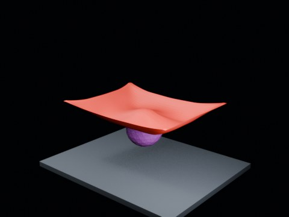

# Ball Drop Tearing — Hammock 1.90 Long Wide

144-frame distant-view hammock run between the previous tearing and no-tear thresholds.

- source commit: `a29c215dff6b583e39bb58439cacff79a00d6bdb`
- Actions run: `9` (`36472219772`)
- Blender line: **5.2 experimental Cloth Dynamics / Tearing**



## Validation

```json
{
  "experiment": "cloth-tearing-ball-drop-hammock-th190-longwide-gn52",
  "pattern": "hammock",
  "blender_version": "5.2.2 LTS",
  "impact_frame": 20,
  "frame_end": 144,
  "duration_seconds": 6.0,
  "tear_observed": false,
  "first_tear_frame": null,
  "tear_after_planned_contact": false,
  "base_vertices": 1575,
  "max_vertices": 1575,
  "max_components": 1,
  "tear_edge_count": 728,
  "custom_mode_applied": true,
  "preview_frame": 28,
  "preview_sha256": "37a60678eb74f949c7d0c6d9eb949a13065fc8b4519cf767da4924a76602903a",
  "video_size_bytes": 30744,
  "blend_size_bytes": 315065
}
```
