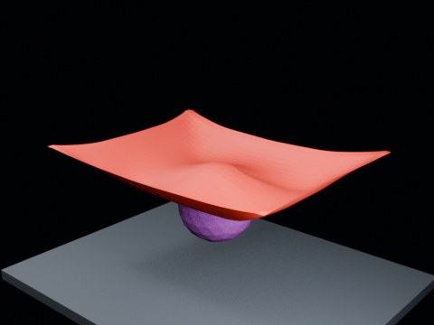

# Ball Drop Tearing — Hammock Threshold 2.20 Fast Ball

Overnight hammock test at threshold 2.20 with a larger fast collider.

- source commit: `aa660ca7aa9e59dfcbe8a97bfc5ad4fe21ff0664`
- Actions run: `8` (`36463210144`)
- Blender line: **5.2 experimental Cloth Dynamics / Tearing**



## Validation

```json
{
  "experiment": "cloth-tearing-ball-drop-hammock-th220-fastball-gn52",
  "pattern": "hammock",
  "blender_version": "5.2.2 LTS",
  "impact_frame": 20,
  "tear_observed": false,
  "first_tear_frame": null,
  "tear_after_planned_contact": false,
  "base_vertices": 1575,
  "max_vertices": 1575,
  "max_components": 1,
  "tear_edge_count": 728,
  "custom_mode_applied": true,
  "preview_frame": 28,
  "preview_sha256": "45db3147d5484fb3d0420d86537be6879c00ee5361f44af40adfba29af41ff55",
  "video_size_bytes": 33863,
  "blend_size_bytes": 315047
}
```
