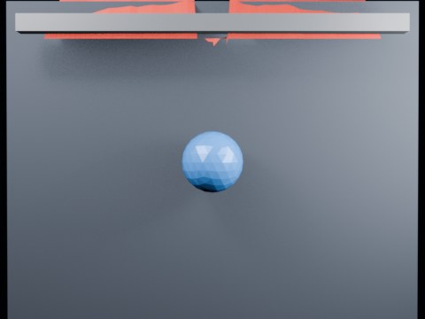

# Ball Impact Tearing — Centerline

A prescribed sphere strikes a hanging Blender 5.2 Cloth Dynamics sheet. Only a narrow vertical edge band is tear-enabled to test a controlled rip from the impact point.

- source commit: `2e1914dc1c2f97f3ac0860ff4dd98978939eeb1e`
- Actions run: `4` (`36411738548`)
- Blender line: **5.2 experimental Cloth Dynamics / Tearing**



## Validation

```json
{
  "experiment": "cloth-tearing-ball-impact-centerline-gn52",
  "pattern": "centerline",
  "blender_version": "5.2.2 LTS",
  "impact_frame": 28,
  "tear_observed": true,
  "first_tear_frame": 2,
  "tear_after_planned_contact": false,
  "base_vertices": 1575,
  "max_vertices": 1973,
  "max_components": 122,
  "tear_edge_count": 310,
  "custom_mode_applied": true,
  "preview_frame": 31,
  "preview_sha256": "e1f0b3ed5a21151f55b675a2acd9adab80d32e6dc2a0ffca59232ced39e22d28",
  "video_size_bytes": 74117,
  "blend_size_bytes": 320821
}
```
