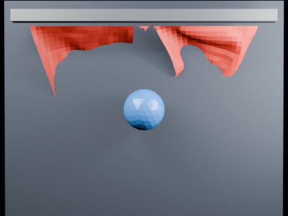

# Ball Impact Tearing — Centerline Threshold 1.20

Threshold calibration run. Same centerline impact as the baseline, with tearing threshold raised from 1.11 to 1.20 to suppress frame-2 self tearing.

- source commit: `fdeb60aae5c9d8690f0e91ca944492840a347284`
- Actions run: `6` (`36414569236`)
- Blender line: **5.2 experimental Cloth Dynamics / Tearing**



## Validation

```json
{
  "experiment": "cloth-tearing-ball-impact-centerline-th120-gn52",
  "pattern": "centerline",
  "blender_version": "5.2.2 LTS",
  "impact_frame": 28,
  "tear_observed": true,
  "first_tear_frame": 2,
  "tear_after_planned_contact": false,
  "base_vertices": 1575,
  "max_vertices": 1906,
  "max_components": 102,
  "tear_edge_count": 310,
  "custom_mode_applied": true,
  "preview_frame": 31,
  "preview_sha256": "41b1833497010fd6cf6690ca26c9e3011e62fd738d1fe10c6ffbe276ca0a0c6f",
  "video_size_bytes": 87716,
  "blend_size_bytes": 320787
}
```
