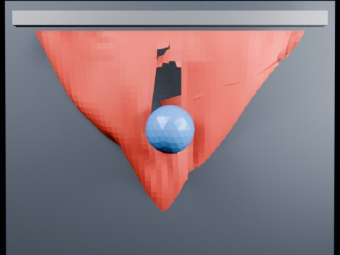

# Ball Impact Tearing — Centerline Threshold 1.55

High-threshold centerline calibration run. Tests whether the cloth can remain intact until the prescribed sphere impact.

- source commit: `de81cc079b31d67ed67a6047144d9e5860455575`
- Actions run: `5` (`36414555350`)
- Blender line: **5.2 experimental Cloth Dynamics / Tearing**



## Validation

```json
{
  "experiment": "cloth-tearing-ball-impact-centerline-th155-gn52",
  "pattern": "centerline",
  "blender_version": "5.2.2 LTS",
  "impact_frame": 28,
  "tear_observed": true,
  "first_tear_frame": 2,
  "tear_after_planned_contact": false,
  "base_vertices": 1575,
  "max_vertices": 1761,
  "max_components": 52,
  "tear_edge_count": 310,
  "custom_mode_applied": true,
  "preview_frame": 31,
  "preview_sha256": "7fadb8ab53bc3cd1911544f5eb3effc5bb925fd330ad1b3feb526578819302aa",
  "video_size_bytes": 87264,
  "blend_size_bytes": 320791
}
```
