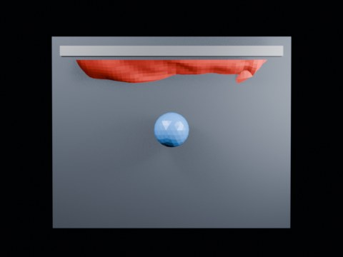

# Ball Impact Tearing — Centerline 1.95 Long Wide

Long-view 144-frame centerline calibration at threshold 1.95.

- source commit: `a29c215dff6b583e39bb58439cacff79a00d6bdb`
- Actions run: `9` (`36472219772`)
- Blender line: **5.2 experimental Cloth Dynamics / Tearing**



## Validation

```json
{
  "experiment": "cloth-tearing-ball-impact-centerline-th195-longwide-gn52",
  "pattern": "centerline",
  "blender_version": "5.2.2 LTS",
  "impact_frame": 28,
  "frame_end": 144,
  "duration_seconds": 6.0,
  "tear_observed": true,
  "first_tear_frame": 2,
  "tear_after_planned_contact": false,
  "base_vertices": 1575,
  "max_vertices": 1597,
  "max_components": 4,
  "tear_edge_count": 310,
  "custom_mode_applied": true,
  "preview_frame": 31,
  "preview_sha256": "bd33b776e903d88aed3f75ae8db098a8c9253666fdf2d2db219735978e12cbcd",
  "video_size_bytes": 64837,
  "blend_size_bytes": 320785
}
```
