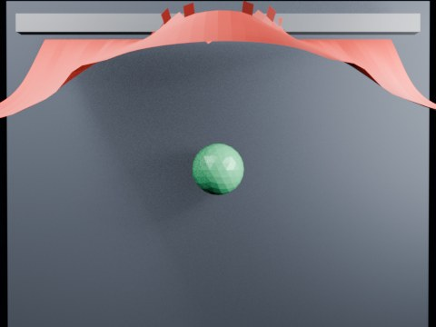

# Ball Impact Tearing — Local Zone

A smaller faster sphere strikes the center of a hanging cloth. Tearing is allowed only in a compact circular impact zone to test puncture-like local failure.

- source commit: `6ba74a94efe805991750ee7469091da31817a27d`
- Actions run: `3` (`36411733508`)
- Blender line: **5.2 experimental Cloth Dynamics / Tearing**



## Validation

```json
{
  "experiment": "cloth-tearing-ball-impact-local-zone-gn52",
  "pattern": "local-zone",
  "blender_version": "5.2.2 LTS",
  "impact_frame": 24,
  "tear_observed": true,
  "first_tear_frame": 2,
  "tear_after_planned_contact": false,
  "base_vertices": 1575,
  "max_vertices": 2105,
  "max_components": 163,
  "tear_edge_count": 369,
  "custom_mode_applied": true,
  "preview_frame": 27,
  "preview_sha256": "5ff4dd381f0c4a1b7ed53aaa25674b4e3f18b411114cf8c81983fc447cd4003d",
  "video_size_bytes": 71759,
  "blend_size_bytes": 320420
}
```
