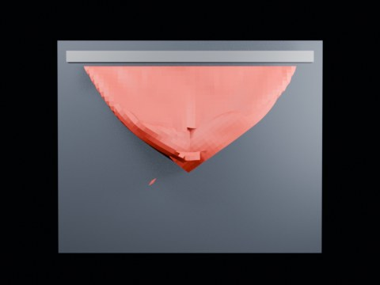

# Ball Impact Tearing — Local Zone 1.90 Long Wide

144-frame distant-view local-zone run near the observed tearing boundary.

- source commit: `a29c215dff6b583e39bb58439cacff79a00d6bdb`
- Actions run: `9` (`36472219772`)
- Blender line: **5.2 experimental Cloth Dynamics / Tearing**



## Validation

```json
{
  "experiment": "cloth-tearing-ball-impact-local-zone-th190-longwide-gn52",
  "pattern": "local-zone",
  "blender_version": "5.2.2 LTS",
  "impact_frame": 24,
  "frame_end": 144,
  "duration_seconds": 6.0,
  "tear_observed": true,
  "first_tear_frame": 2,
  "tear_after_planned_contact": false,
  "base_vertices": 1575,
  "max_vertices": 1621,
  "max_components": 11,
  "tear_edge_count": 369,
  "custom_mode_applied": true,
  "preview_frame": 27,
  "preview_sha256": "c3ad6c821be43c13ccef48efae2aa6c0dc6998f6e26736dc9b85f6a905f60afd",
  "video_size_bytes": 77062,
  "blend_size_bytes": 320433
}
```
