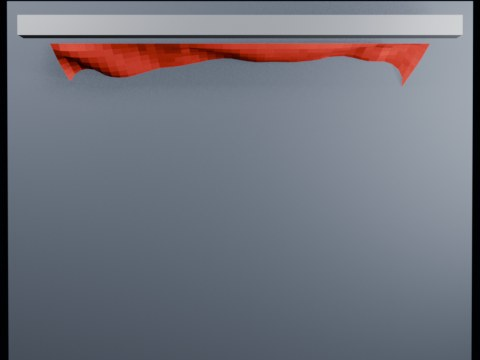

# Ball Impact Tearing — Local Zone Threshold 2.20

Overnight local-zone test at threshold 2.20.

- source commit: `aa660ca7aa9e59dfcbe8a97bfc5ad4fe21ff0664`
- Actions run: `8` (`36463210144`)
- Blender line: **5.2 experimental Cloth Dynamics / Tearing**



## Validation

```json
{
  "experiment": "cloth-tearing-ball-impact-local-zone-th220-gn52",
  "pattern": "local-zone",
  "blender_version": "5.2.2 LTS",
  "impact_frame": 24,
  "tear_observed": false,
  "first_tear_frame": null,
  "tear_after_planned_contact": false,
  "base_vertices": 1575,
  "max_vertices": 1575,
  "max_components": 1,
  "tear_edge_count": 369,
  "custom_mode_applied": true,
  "preview_frame": 32,
  "preview_sha256": "839e0b3938f891e07b752ba549c18fbbaa7e007a21fc8c8f6eb6082acb63698d",
  "video_size_bytes": 72130,
  "blend_size_bytes": 320466
}
```
