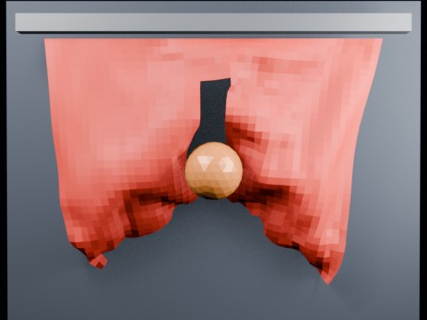

# Ball Impact Tearing — Seed Notch

A hanging cloth starts with a small central notch and a narrow tear-enabled band. A sphere hits the notch region to test crack growth from a seeded defect.

- source commit: `6ba74a94efe805991750ee7469091da31817a27d`
- Actions run: `3` (`36411733508`)
- Blender line: **5.2 experimental Cloth Dynamics / Tearing**



## Validation

```json
{
  "experiment": "cloth-tearing-ball-impact-notch-gn52",
  "pattern": "notch",
  "blender_version": "5.2.2 LTS",
  "impact_frame": 26,
  "tear_observed": true,
  "first_tear_frame": 2,
  "tear_after_planned_contact": false,
  "base_vertices": 1575,
  "max_vertices": 1822,
  "max_components": 77,
  "tear_edge_count": 181,
  "custom_mode_applied": true,
  "preview_frame": 29,
  "preview_sha256": "40fcfd8cb0af0f87d12782c3894979d651dae282ac886282c6ca7d8007f5159f",
  "video_size_bytes": 80484,
  "blend_size_bytes": 320391
}
```
