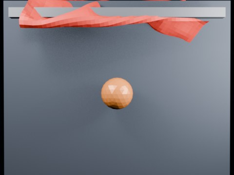

# Ball Impact Tearing — Seed Notch Threshold 1.45

Seed-notch follow-up with a much higher tearing threshold, testing whether the pre-cut notch localizes a tear at impact instead of failing at frame 2.

- source commit: `de81cc079b31d67ed67a6047144d9e5860455575`
- Actions run: `5` (`36414555350`)
- Blender line: **5.2 experimental Cloth Dynamics / Tearing**



## Validation

```json
{
  "experiment": "cloth-tearing-ball-impact-notch-th145-gn52",
  "pattern": "notch",
  "blender_version": "5.2.2 LTS",
  "impact_frame": 26,
  "tear_observed": true,
  "first_tear_frame": 2,
  "tear_after_planned_contact": false,
  "base_vertices": 1575,
  "max_vertices": 1733,
  "max_components": 43,
  "tear_edge_count": 181,
  "custom_mode_applied": true,
  "preview_frame": 29,
  "preview_sha256": "2dde8e7705fd855c9bbdebe036ceb1c246b26d766e5b487d1cd732003b1f3632",
  "video_size_bytes": 70758,
  "blend_size_bytes": 320381
}
```
