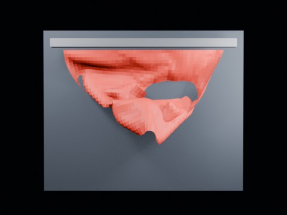

# Ball Impact Tearing — Seed Notch 1.90 Long Wide

144-frame distant-view seed-notch run near the observed tearing boundary.

- source commit: `a29c215dff6b583e39bb58439cacff79a00d6bdb`
- Actions run: `9` (`36472219772`)
- Blender line: **5.2 experimental Cloth Dynamics / Tearing**



## Validation

```json
{
  "experiment": "cloth-tearing-ball-impact-notch-th190-longwide-gn52",
  "pattern": "notch",
  "blender_version": "5.2.2 LTS",
  "impact_frame": 26,
  "frame_end": 144,
  "duration_seconds": 6.0,
  "tear_observed": true,
  "first_tear_frame": 2,
  "tear_after_planned_contact": false,
  "base_vertices": 1575,
  "max_vertices": 1592,
  "max_components": 3,
  "tear_edge_count": 181,
  "custom_mode_applied": true,
  "preview_frame": 29,
  "preview_sha256": "3208b775ec3e103aacbc42e5af3c07daa9de02120c815d6243cd4749c91419c3",
  "video_size_bytes": 84488,
  "blend_size_bytes": 320340
}
```
