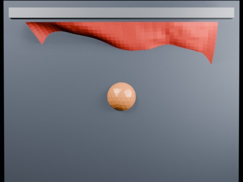

# Ball Impact Tearing — Seed Notch Threshold 2.20

Overnight seed-notch test at threshold 2.20.

- source commit: `aa660ca7aa9e59dfcbe8a97bfc5ad4fe21ff0664`
- Actions run: `8` (`36463210144`)
- Blender line: **5.2 experimental Cloth Dynamics / Tearing**



## Validation

```json
{
  "experiment": "cloth-tearing-ball-impact-notch-th220-gn52",
  "pattern": "notch",
  "blender_version": "5.2.2 LTS",
  "impact_frame": 26,
  "tear_observed": false,
  "first_tear_frame": null,
  "tear_after_planned_contact": false,
  "base_vertices": 1575,
  "max_vertices": 1575,
  "max_components": 1,
  "tear_edge_count": 181,
  "custom_mode_applied": true,
  "preview_frame": 34,
  "preview_sha256": "ecd991498bc038e24fd6c4fc3aaf2dea65b8ce059424dc8eaf7f0b6c12d84c23",
  "video_size_bytes": 80404,
  "blend_size_bytes": 320324
}
```
