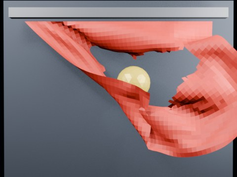

# Ball Impact Tearing — Oblique Swing

A sphere follows an oblique side-impact path into a hanging cloth. A diagonal tear-enabled band tests whether the rip follows the impact direction.

- source commit: `2e1914dc1c2f97f3ac0860ff4dd98978939eeb1e`
- Actions run: `4` (`36411738548`)
- Blender line: **5.2 experimental Cloth Dynamics / Tearing**



## Validation

```json
{
  "experiment": "cloth-tearing-ball-swing-impact-gn52",
  "pattern": "swing",
  "blender_version": "5.2.2 LTS",
  "impact_frame": 29,
  "tear_observed": true,
  "first_tear_frame": 2,
  "tear_after_planned_contact": false,
  "base_vertices": 1575,
  "max_vertices": 1983,
  "max_components": 115,
  "tear_edge_count": 305,
  "custom_mode_applied": true,
  "preview_frame": 32,
  "preview_sha256": "245034cb0072b775575f46a97c5cecc88c41369e1fa89bfca524201fa3c85d94",
  "video_size_bytes": 122878,
  "blend_size_bytes": 320909
}
```
