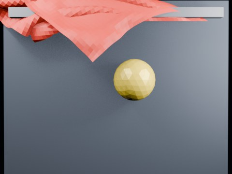

# Ball Swing Impact Tearing — Threshold 2.20 Fast

Overnight oblique swing test at threshold 2.20 with a larger faster collider.

- source commit: `aa660ca7aa9e59dfcbe8a97bfc5ad4fe21ff0664`
- Actions run: `8` (`36463210144`)
- Blender line: **5.2 experimental Cloth Dynamics / Tearing**



## Validation

```json
{
  "experiment": "cloth-tearing-ball-swing-impact-th220-fast-gn52",
  "pattern": "swing",
  "blender_version": "5.2.2 LTS",
  "impact_frame": 22,
  "tear_observed": true,
  "first_tear_frame": 2,
  "tear_after_planned_contact": false,
  "base_vertices": 1575,
  "max_vertices": 1673,
  "max_components": 22,
  "tear_edge_count": 305,
  "custom_mode_applied": true,
  "preview_frame": 25,
  "preview_sha256": "5d42f484119da514a774f8080e443c4e47af1b67df0fc1733e2742ec0875255e",
  "video_size_bytes": 97853,
  "blend_size_bytes": 320846
}
```
