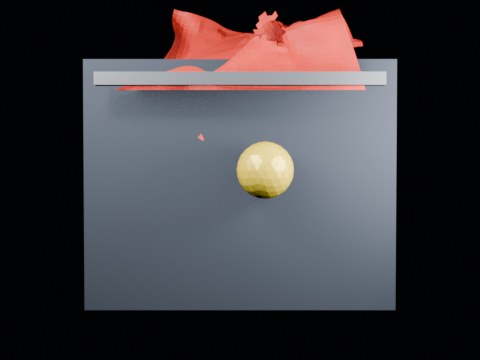

# Ball Swing Impact Tearing — 2.60 Long Wide

144-frame distant-view swing run above the previous 2.20 self-tearing threshold.

- source commit: `a29c215dff6b583e39bb58439cacff79a00d6bdb`
- Actions run: `9` (`36472219772`)
- Blender line: **5.2 experimental Cloth Dynamics / Tearing**



## Validation

```json
{
  "experiment": "cloth-tearing-ball-swing-impact-th260-longwide-gn52",
  "pattern": "swing",
  "blender_version": "5.2.2 LTS",
  "impact_frame": 22,
  "frame_end": 144,
  "duration_seconds": 6.0,
  "tear_observed": true,
  "first_tear_frame": 2,
  "tear_after_planned_contact": false,
  "base_vertices": 1575,
  "max_vertices": 1652,
  "max_components": 18,
  "tear_edge_count": 305,
  "custom_mode_applied": true,
  "preview_frame": 25,
  "preview_sha256": "06f4f08de160e62e6a8a87f20fafa73704deb766d4671560a02b3e171ee429b0",
  "video_size_bytes": 90560,
  "blend_size_bytes": 320837
}
```
