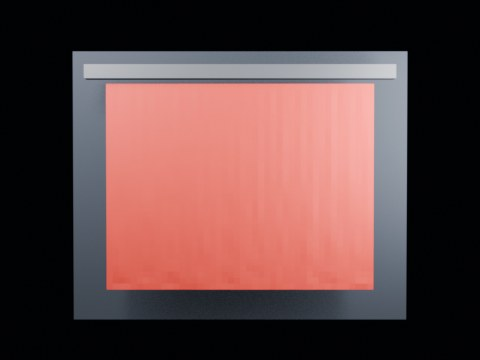

# Cloth Tearing Control — Centerline 1.95 No Contact Long Wide

144-frame no-contact control at threshold 1.95 with the same distant camera.

- source commit: `a29c215dff6b583e39bb58439cacff79a00d6bdb`
- Actions run: `9` (`36472219772`)
- Blender line: **5.2 experimental Cloth Dynamics / Tearing**



## Validation

```json
{
  "experiment": "cloth-tearing-centerline-th195-no-contact-longwide-gn52",
  "pattern": "centerline",
  "blender_version": "5.2.2 LTS",
  "impact_frame": 28,
  "frame_end": 144,
  "duration_seconds": 6.0,
  "tear_observed": false,
  "first_tear_frame": null,
  "tear_after_planned_contact": false,
  "base_vertices": 1575,
  "max_vertices": 1575,
  "max_components": 1,
  "tear_edge_count": 310,
  "custom_mode_applied": true,
  "preview_frame": 36,
  "preview_sha256": "8e158f0e14b8baca9652c8aaca4cf774abd84402bdc383dd8c566e078c7fcf9d",
  "video_size_bytes": 9906,
  "blend_size_bytes": 320781
}
```
