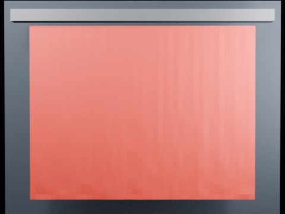

# Cloth Tearing Control — Centerline Threshold 2.20 No Contact

No-contact control for threshold 2.20. The prescribed sphere follows the same timing but stays far outside the cloth to separate intrinsic tearing from impact-triggered tearing.

- source commit: `aa660ca7aa9e59dfcbe8a97bfc5ad4fe21ff0664`
- Actions run: `8` (`36463210144`)
- Blender line: **5.2 experimental Cloth Dynamics / Tearing**



## Validation

```json
{
  "experiment": "cloth-tearing-centerline-th220-no-contact-gn52",
  "pattern": "centerline",
  "blender_version": "5.2.2 LTS",
  "impact_frame": 28,
  "tear_observed": false,
  "first_tear_frame": null,
  "tear_after_planned_contact": false,
  "base_vertices": 1575,
  "max_vertices": 1575,
  "max_components": 1,
  "tear_edge_count": 310,
  "custom_mode_applied": true,
  "preview_frame": 36,
  "preview_sha256": "a4fda3f1a2f7fc7b847c0598783f04bd09e1ef95387a7daaa38f483d8483fe3d",
  "video_size_bytes": 9931,
  "blend_size_bytes": 320777
}
```
