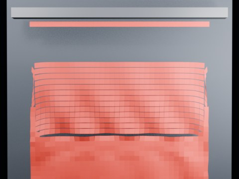

# Blender 5.2 Cloth Dynamics Minimal Tearing

Experimental Blender 5.2.2 Geometry Nodes Cloth Dynamics / XPBD tearing test. A top-pinned hanging cloth is pulled by strong gravity and validated by actual topology changes.

- source commit: \`fe22bba134458c8ce9869945bad391ca88169237\`
- Actions run: \`9\` (\`36395395118\`)
- Blender line: **5.2 experimental Cloth Dynamics / Tearing**

## Validation

\`\`\`json
{
  "experiment": "cloth-tearing-minimal-gn52",
  "blender_version": "5.2.2 LTS",
  "asset_source": "direct:/home/runner/work/tmp-blender-rigid-cloth/tmp-blender-rigid-cloth/.cache/blender52-runtime/blender/5.2/datafiles/assets/nodes/geometry_nodes_dynamics_assets.blend",
  "first_tear_frame": 2,
  "base_vertices": 1073,
  "max_vertices": 2561,
  "max_components": 491,
  "preview_frame": 8,
  "preview_sha256": "43102e785dd748ca0918bac12f126631dae5c7e1cb0ee580c2f2c467506d1d5f",
  "video_size_bytes": 18553,
  "blend_size_bytes": 288366
}
\`\`\`

## License / ライセンス

Unless otherwise noted, generated assets in this result are CC0-1.0.
Source code and workflow files used to generate them are MIT-0.
