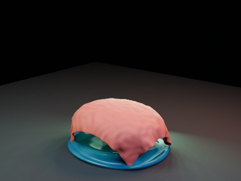

# Cloth Water-like Blob Impact EEVEE

A Cloth sheet falls onto a translucent water-like Soft Body blob. This is deliberately not a true fluid simulation: it tests direct live Cloth/Soft Body collision coupling before moving to Mantaflow.

- source commit: `3a2038f957188195b5b3233cf06e2f39c1c5e032`
- Actions run: `8` (`36277326647`)
- full artifact: `blender-cloth-water-blob-impact-eevee`

## Blend files

- Git: [cloth-water-blob-impact-eevee.blend](./cloth-water-blob-impact-eevee.blend) (5,131,608 bytes)



## Validation

```json
{
  "video": "cloth-water-blob-impact-eevee.mp4",
  "preview": {
    "path": "output/preview.png",
    "size_bytes": 191097,
    "width": 480,
    "height": 360,
    "luminance_min": 0,
    "luminance_max": 219,
    "luminance_mean": 44.985,
    "luminance_stddev": 49.111,
    "sha256": "6f51137d66e72bb3d79cc5092f0c680cf5f704e38f88820ebd1127ef9dca25db"
  },
  "movie": {
    "path": "output/cloth-water-blob-impact-eevee.mp4",
    "size_bytes": 42632,
    "width": 480,
    "height": 360,
    "duration_seconds": 8.0,
    "avg_frame_rate": "24/1",
    "nb_frames": "192",
    "sha256": "c18cab6fdbbc48393a166fc616034294921a2561fe09694cbf636a8a535505d2"
  },
  "report": {
    "engine": "BLENDER_EEVEE",
    "blob_vertex_count": 546,
    "blob_max_displacement": 1.602084,
    "blob_peak_frame": 64,
    "blob_center_top_drop": 1.447046,
    "cloth_vertex_count": 1085,
    "cloth_max_displacement": 3.538263,
    "cloth_min_vertex_z": 0.034998,
    "first_contact_frame": 23,
    "coverage_at_blob_peak": 0.979724,
    "min_abs_center_gap": 0.374365,
    "min_abs_center_gap_frame": 26,
    "cloth_simulation_seconds": 15.062,
    "blob_simulation_seconds": 11.427,
    "blend_size_bytes": 5131608
  }
}
```

## License / ライセンス

Unless otherwise noted, generated assets in this result (including rendered images, video, and generated .blend files) are CC0-1.0. Source code and workflow files used to generate them are MIT-0.

特記のない限り、この成果物内の生成アセット（レンダリング画像、動画、生成された .blend ファイル等）は CC0-1.0、生成に使用したソースコードや workflow は MIT-0 です。

Third-party data, assets, or source material remain subject to their original licenses and terms. These repository licenses apply only to rights we are entitled to grant.

第三者のデータ・アセット・素材・ソースを利用している部分は、利用元のライセンスおよび利用条件に従います。このリポジトリのライセンスは、こちらが許諾できる権利にのみ適用されます。

See ../../LICENSE and ../../LICENSES/ for details.
