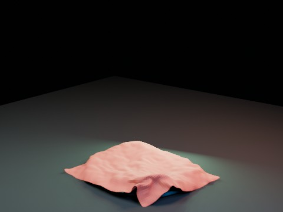

# Cloth Water-like Blob Impact V2 EEVEE

A three-pass staged Cloth/Soft Body experiment. A guide Cloth first drives the water-like blob, then a fresh visible Cloth is solved against the baked animated blob to reduce the floating/separation artifact observed in V1.

- source commit: `9c95751a52e551055dfe28f8ccef8a9e95b16431`
- Actions run: `9` (`36277898368`)
- full artifact: `blender-cloth-water-blob-impact-v2-eevee`

## Blend files

- Git: [cloth-water-blob-impact-v2-eevee.blend](./cloth-water-blob-impact-v2-eevee.blend) (7,871,744 bytes)



## Validation

```json
{
  "video": "cloth-water-blob-impact-v2-eevee.mp4",
  "preview": {
    "path": "output/preview.png",
    "size_bytes": 183015,
    "width": 480,
    "height": 360,
    "luminance_min": 0,
    "luminance_max": 218,
    "luminance_mean": 45.446,
    "luminance_stddev": 53.509,
    "sha256": "be88c19926f5c08f51029c99fb368f23a34c30855be693d6ebfd5aa6492f656f"
  },
  "movie": {
    "path": "output/cloth-water-blob-impact-v2-eevee.mp4",
    "size_bytes": 50869,
    "width": 480,
    "height": 360,
    "duration_seconds": 8.0,
    "avg_frame_rate": "24/1",
    "nb_frames": "192",
    "sha256": "550bc8a8ea5ce818a53c7de9de2cc73c2eb200a611859d803b7b43d2bd3d2b3b"
  },
  "report": {
    "engine": "BLENDER_EEVEE",
    "blob_max_displacement": 1.604002,
    "blob_peak_frame": 63,
    "guide_gap_at_blob_peak": 1.285187,
    "final_gap_at_blob_peak": 0.059224,
    "gap_improvement_from_guide": 1.225963,
    "final_coverage_at_blob_peak": 0.782488,
    "max_positive_gap_after_contact": 0.161919,
    "guide_simulation_seconds": 15.78,
    "blob_simulation_seconds": 11.548,
    "final_cloth_simulation_seconds": 22.222,
    "blend_size_bytes": 7871744
  }
}
```

## License / ライセンス

Unless otherwise noted, generated assets in this result (including rendered images, video, and generated .blend files) are CC0-1.0. Source code and workflow files used to generate them are MIT-0.

特記のない限り、この成果物内の生成アセット（レンダリング画像、動画、生成された .blend ファイル等）は CC0-1.0、生成に使用したソースコードや workflow は MIT-0 です。

Third-party data, assets, or source material remain subject to their original licenses and terms. These repository licenses apply only to rights we are entitled to grant.

第三者のデータ・アセット・素材・ソースを利用している部分は、利用元のライセンスおよび利用条件に従います。このリポジトリのライセンスは、こちらが許諾できる権利にのみ適用されます。

See ../../LICENSE and ../../LICENSES/ for details.
