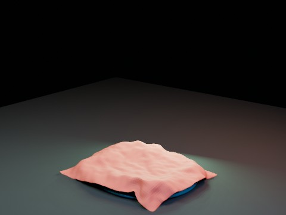

# Cloth Water-like Blob Impact V3 EEVEE

V3 keeps the stable three-pass staged solve but uses a slightly expanded invisible collision shell for the final Cloth pass, aiming to remove the slime-eating/cloth-ingestion appearance without reintroducing floating.

- source commit: `cd8e4fed283588aabf346283026d94c85a56c341`
- Actions run: `11` (`36280045202`)
- full artifact: `blender-cloth-water-blob-impact-v3-eevee`

## Blend files

- Git: [cloth-water-blob-impact-v3-eevee.blend](./cloth-water-blob-impact-v3-eevee.blend) (7,871,480 bytes)



## Validation

```json
{
  "video": "cloth-water-blob-impact-v3-eevee.mp4",
  "preview": {
    "path": "output/preview.png",
    "size_bytes": 182958,
    "width": 480,
    "height": 360,
    "luminance_min": 0,
    "luminance_max": 222,
    "luminance_mean": 45.769,
    "luminance_stddev": 54.17,
    "sha256": "024783066bf3df701e5198eb6c11790dc7d751d2bdf4c4fdb039955dbe4dd343"
  },
  "movie": {
    "path": "output/cloth-water-blob-impact-v3-eevee.mp4",
    "size_bytes": 46455,
    "width": 480,
    "height": 360,
    "duration_seconds": 8.0,
    "avg_frame_rate": "24/1",
    "nb_frames": "192",
    "sha256": "a5c4cc83da7b599d9b8eb985fb4379e2aa64f6f526a2f16bb1d56fcb4a50da2f"
  },
  "report": {
    "engine": "BLENDER_EEVEE",
    "blob_max_displacement": 1.602084,
    "blob_peak_frame": 64,
    "v2_peak_gap": 0.059224,
    "v3_peak_gap": 0.054504,
    "v3_min_gap_after_contact": 0.022391,
    "v3_max_gap_after_contact": 0.265121,
    "v3_coverage_at_blob_peak": 0.762212,
    "final_cloth_simulation_seconds": 13.567,
    "blend_size_bytes": 7871480
  }
}
```

## License / ライセンス

Unless otherwise noted, generated assets in this result (including rendered images, video, and generated .blend files) are CC0-1.0. Source code and workflow files used to generate them are MIT-0.

特記のない限り、この成果物内の生成アセット（レンダリング画像、動画、生成された .blend ファイル等）は CC0-1.0、生成に使用したソースコードや workflow は MIT-0 です。

Third-party data, assets, or source material remain subject to their original licenses and terms. These repository licenses apply only to rights we are entitled to grant.

第三者のデータ・アセット・素材・ソースを利用している部分は、利用元のライセンスおよび利用条件に従います。このリポジトリのライセンスは、こちらが許諾できる権利にのみ適用されます。

See ../../LICENSE and ../../LICENSES/ for details.
