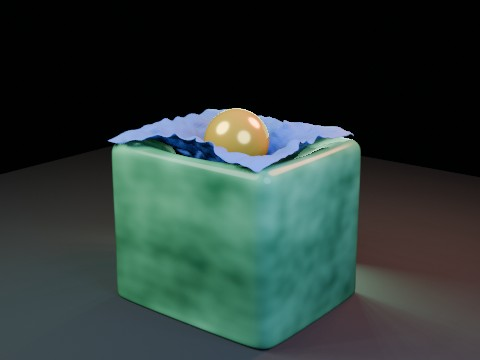

# Cloth Wrap on Jelly with Delayed Ball EEVEE

A smaller high-friction cloth settles over the jelly, then one heavier rigid-body ball is released exactly two seconds later to press the cloth into the deforming jelly surface.

- source commit: `f55c3fbc6c038101ef5c61d61c0e4503d852996b`
- Actions run: `4` (`36248780462`)
- full artifact: `blender-cloth-wrap-jelly-delayed-ball-eevee`

## Blend files

- Git: [cloth-wrap-jelly-delayed-ball-eevee.blend](./cloth-wrap-jelly-delayed-ball-eevee.blend) (6,162,972 bytes)



## Validation

```json
{
  "video": "cloth-wrap-jelly-delayed-ball-eevee.mp4",
  "preview": {
    "path": "output/preview.png",
    "size_bytes": 203568,
    "width": 480,
    "height": 360,
    "luminance_min": 0,
    "luminance_max": 236,
    "luminance_mean": 53.713,
    "luminance_stddev": 52.422,
    "sha256": "61756bf6ff4ddf971070592911ef2157727de2bc39ef1f440d69338b5f2e07d2"
  },
  "movie": {
    "path": "output/cloth-wrap-jelly-delayed-ball-eevee.mp4",
    "size_bytes": 48381,
    "width": 480,
    "height": 360,
    "duration_seconds": 8.0,
    "avg_frame_rate": "24/1",
    "nb_frames": "192",
    "sha256": "90d6d6d8d4dd2aca892b42dffed4b92bbfeb677a5086b183a109f6538c6c1733"
  },
  "report": {
    "engine": "BLENDER_EEVEE",
    "jelly_max_displacement": 1.591789,
    "jelly_max_displacement_frame": 75,
    "cloth_vertex_count": 1085,
    "cloth_coverage_at_release": 0.906912,
    "cloth_coverage_at_impact": 0.970507,
    "cloth_center_z_at_release": 2.627247,
    "cloth_center_z_at_impact": 2.271256,
    "cloth_center_press_depth": 0.355991,
    "cloth_min_vertex_z": 1.914635,
    "ball_release_frame": 49,
    "ball_release_seconds": 2.0,
    "ball_impact_frame": 71,
    "ball_final_location": [
      0.0,
      0.0,
      2.56
    ],
    "possible_proxy_tunneling": false,
    "substeps_per_frame": 10,
    "solver_iterations": 35,
    "blend_size_bytes": 6162972
  }
}
```

## License / ライセンス

Unless otherwise noted, generated assets in this result (including rendered images, video, and generated .blend files) are CC0-1.0. Source code and workflow files used to generate them are MIT-0.

特記のない限り、この成果物内の生成アセット（レンダリング画像、動画、生成された .blend ファイル等）は CC0-1.0、生成に使用したソースコードや workflow は MIT-0 です。

Third-party data, assets, or source material remain subject to their original licenses and terms. These repository licenses apply only to rights we are entitled to grant.

第三者のデータ・アセット・素材・ソースを利用している部分は、利用元のライセンスおよび利用条件に従います。このリポジトリのライセンスは、こちらが許諾できる権利にのみ適用されます。

See ../../LICENSE and ../../LICENSES/ for details.
