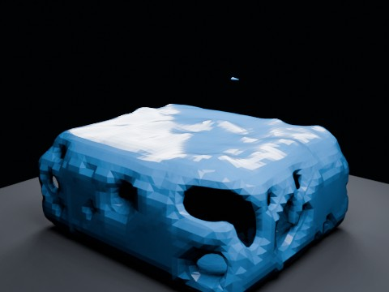

# Mantaflow Liquid + Baked Deforming Cloth Effector EEVEE

A real Cloth simulation is baked to shape keys first, then replayed as an animated planar Mantaflow Fluid Effector while true FLIP liquid falls onto it. Coupling remains deliberately one-way from the deforming Cloth into the liquid solve.

- source commit: `336efd383e3906fd518f99450a900fd9f1671fd1`
- Actions run: `15` (`36323492407`)
- full artifact: `blender-mantaflow-liquid-baked-cloth-effector-eevee`



## Validation

```json
{
  "video": "mantaflow-liquid-baked-cloth-effector-eevee.mp4",
  "preview": {
    "size_bytes": 178510,
    "width": 480,
    "height": 360,
    "luminance_min": 0,
    "luminance_max": 243,
    "luminance_mean": 51.225,
    "luminance_stddev": 66.328,
    "sha256": "fb125185384737fc301732ebf83813333e1bcb3fba0a6716bd22bb36e2a4f287"
  },
  "movie": {
    "size_bytes": 546284,
    "expected_width": 480,
    "expected_height": 360,
    "expected_duration_seconds": 4.0,
    "expected_fps": 24,
    "expected_frames": 96,
    "sha256": "ad45e818a98ca178b199a23f4143ac1b300680d188c47c41b92c84022943771b"
  },
  "report": {
    "fluid_solver": "Mantaflow liquid / FLIP",
    "cloth_simulation_seconds": 6.541,
    "cloth_max_displacement": 0.167572,
    "cloth_center_z_samples": {
      "1": 1.72006,
      "12": 1.627111,
      "24": 1.597803,
      "48": 1.648264,
      "72": 1.620421,
      "96": 1.635746
    },
    "cloth_center_sag": 0.122257,
    "fluid_bake_seconds": 31.603,
    "cache_file_count": 288,
    "cache_bytes": 90078386,
    "sample_vertex_counts": {
      "1": 1308,
      "12": 1292,
      "24": 11540,
      "48": 14576,
      "72": 10212,
      "96": 9338
    },
    "max_lateral_span": 4.97249,
    "min_fluid_z": 0.06646
  },
  "blend_size_bytes": 2772140
}
```

## License / ライセンス

Unless otherwise noted, generated assets in this result (including rendered images, video, and generated .blend files) are CC0-1.0. Source code and workflow files used to generate them are MIT-0.

特記のない限り、この成果物内の生成アセット（レンダリング画像、動画、生成された .blend ファイル等）は CC0-1.0、生成に使用したソースコードや workflow は MIT-0 です。

Third-party data, assets, or source material remain subject to their original licenses and terms. These repository licenses apply only to rights we are entitled to grant.

第三者のデータ・アセット・素材・ソースを利用している部分は、利用元のライセンスおよび利用条件に従います。このリポジトリのライセンスは、こちらが許諾できる権利にのみ適用されます。

See ../../LICENSE and ../../LICENSES/ for details.
