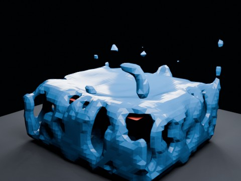

# Mantaflow Liquid + Cloth Effector EEVEE

Minimal true-liquid baseline: Blender 4.0.2 Mantaflow/FLIP liquid falls onto a red Cloth-shaped planar Fluid Effector. The Cloth is static in this first test; coupling is explicitly one-way from Cloth obstacle geometry into the liquid solve.

- source commit: `ba7bf038a693c93817943455aa72f33a0224c328`
- Actions run: `13` (`36322540415`)
- full artifact: `blender-mantaflow-liquid-cloth-effector-eevee`



## Validation

```json
{
  "video": "mantaflow-liquid-cloth-effector-eevee.mp4",
  "preview": {
    "size_bytes": 191190,
    "width": 480,
    "height": 360,
    "luminance_min": 0,
    "luminance_max": 241,
    "luminance_mean": 50.318,
    "luminance_stddev": 63.797,
    "sha256": "92346f3bad98777750c04d8e30b80fc814771f5a12cd05889c4eb34ca16912bd"
  },
  "movie": {
    "size_bytes": 571150,
    "expected_width": 480,
    "expected_height": 360,
    "expected_duration_seconds": 4.0,
    "expected_fps": 24,
    "expected_frames": 96,
    "sha256": "cce652146ea020ff67d8f6ca8f9d74cc9c54aea1529edb3c5f23037ffea11638"
  },
  "report": {
    "fluid_solver": "Mantaflow liquid / FLIP",
    "bake_seconds": 19.635,
    "cache_file_count": 288,
    "cache_bytes": 90734083,
    "sample_vertex_counts": {
      "1": 1324,
      "24": 11168,
      "48": 13750,
      "72": 7548,
      "96": 7768
    },
    "max_lateral_span": 4.975287,
    "min_fluid_z": 0.06646,
    "cloth_vertex_count": 1435
  },
  "blend_size_bytes": 1008864
}
```

## License / ライセンス

Unless otherwise noted, generated assets in this result (including rendered images, video, and generated .blend files) are CC0-1.0. Source code and workflow files used to generate them are MIT-0.

特記のない限り、この成果物内の生成アセット（レンダリング画像、動画、生成された .blend ファイル等）は CC0-1.0、生成に使用したソースコードや workflow は MIT-0 です。

Third-party data, assets, or source material remain subject to their original licenses and terms. These repository licenses apply only to rights we are entitled to grant.

第三者のデータ・アセット・素材・ソースを利用している部分は、利用元のライセンスおよび利用条件に従います。このリポジトリのライセンスは、こちらが許諾できる権利にのみ適用されます。

See ../../LICENSE and ../../LICENSES/ for details.
