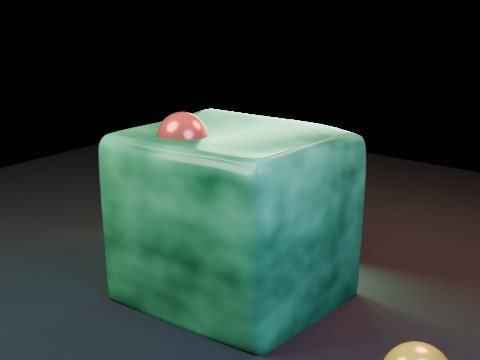

# Soft Body Jelly Cube Ball Drop EEVEE

Three gravity-driven rigid-body balls fall onto a rounded Soft Body jelly cube. Jelly deformation and rigid-body transforms are sampled sequentially and baked before parallel EEVEE frame rendering.

- source commit: `8ac3d934380917610e7e43c9d2515009e48263db`
- Actions run: `2` (`36245202632`)
- full artifact: `blender-softbody-jelly-cube-ball-drop-eevee`

## Blend files

- Git: [softbody-jelly-cube-ball-drop-eevee.blend](./softbody-jelly-cube-ball-drop-eevee.blend) (3,866,244 bytes)



## Validation

```json
{
  "video": "softbody-jelly-cube-ball-drop-eevee.mp4",
  "preview": {
    "path": "output/preview.png",
    "size_bytes": 196602,
    "width": 480,
    "height": 360,
    "luminance_min": 0,
    "luminance_max": 235,
    "luminance_mean": 57.401,
    "luminance_stddev": 56.266,
    "sha256": "4caeaf426191728dd6d9ba411ad6c0dc630af7fb014a88abcc94d1c18414804e"
  },
  "movie": {
    "path": "output/softbody-jelly-cube-ball-drop-eevee.mp4",
    "size_bytes": 43209,
    "width": 480,
    "height": 360,
    "duration_seconds": 8.0,
    "avg_frame_rate": "24/1",
    "nb_frames": "192",
    "sha256": "308ece0edc5847ff9ca4fb68259d93a21f659d1caca9b1fa00d28ecb36221e6d"
  },
  "report": {
    "engine": "BLENDER_EEVEE",
    "jelly_vertex_count": 866,
    "jelly_face_count": 864,
    "baked_shape_keys": 192,
    "shape_key_count": 193,
    "simulation_seconds": 1.835,
    "max_displacement": 1.21717,
    "max_displacement_frame": 59,
    "rigid_body_count": 3,
    "rigid_body_bake_seconds": 0.031,
    "rigid_body_proxy": "JellyRigidProxy",
    "substeps_per_frame": 8,
    "solver_iterations": 30,
    "possible_proxy_tunneling": [],
    "blend_size_bytes": 3866244
  }
}
```

## License / ライセンス

Unless otherwise noted, generated assets in this result (including rendered images, video, and generated .blend files) are CC0-1.0. Source code and workflow files used to generate them are MIT-0.

特記のない限り、この成果物内の生成アセット（レンダリング画像、動画、生成された .blend ファイル等）は CC0-1.0、生成に使用したソースコードや workflow は MIT-0 です。

Third-party data, assets, or source material remain subject to their original licenses and terms. These repository licenses apply only to rights we are entitled to grant.

第三者のデータ・アセット・素材・ソースを利用している部分は、利用元のライセンスおよび利用条件に従います。このリポジトリのライセンスは、こちらが許諾できる権利にのみ適用されます。

See ../../LICENSE and ../../LICENSES/ for details.
